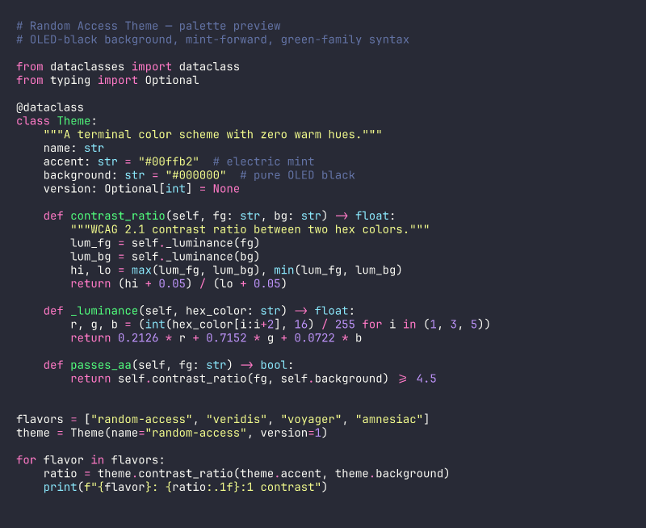

# Random Access Theme

> A dark terminal palette built around a single constraint: no warm hues.

OLED-black background. Mint-forward accent. Green-family syntax — no orange, no purple, no warm red. Minimal noise, maximum clarity.

<!--
  TODO: add hero screenshot here
  
-->

---

## Terminal Support

| Terminal        | File                                                                      |
|-----------------|---------------------------------------------------------------------------|
| Ghostty         | [`themes/ghostty/random-access-theme.conf`](themes/ghostty/random-access-theme.conf) |
| WezTerm         | [`themes/wezterm/random-access-theme.toml`](themes/wezterm/random-access-theme.toml) |
| iTerm2          | [`themes/iterm2/random-access-theme.itermcolors`](themes/iterm2/random-access-theme.itermcolors) |
| Alacritty       | [`themes/alacritty/random-access-theme.toml`](themes/alacritty/random-access-theme.toml) |
| kitty           | [`themes/kitty/random-access-theme.conf`](themes/kitty/random-access-theme.conf) |
| Windows Terminal | [`themes/windows-terminal/random-access-theme.json`](themes/windows-terminal/random-access-theme.json) |
| Pi              | [`themes/pi/random-access-theme.json`](themes/pi/random-access-theme.json) |

---

## Install

### Ghostty

Recommended (safe, no duplicate entries):

```bash
bash scripts/install.sh ghostty
```

This writes the full config to `~/.config/ghostty/config` and stubs the macOS
Library config so Ghostty doesn't merge/duplicate entries.

### WezTerm

```bash
# Place in WezTerm's color scheme directory
cp themes/wezterm/random-access-theme.toml ~/.config/wezterm/colors/
```

Then in your `wezterm.lua`:

```lua
config.color_scheme = "Random Access Theme"
```

### iTerm2

No dynamic profile required.

```bash
bash scripts/install.sh iterm2
```

Then in iTerm2:

1. **Profiles → Colors → Color Presets → Import**
2. Select `~/Library/Application Support/iTerm2/random-access-theme.itermcolors`
3. Select **Random Access Theme** from the preset list

Optional cleanup (only if you want to archive old dynamic profiles):

```bash
bash scripts/install.sh iterm2 --clean-dynamic
```

### Alacritty

```toml
# In alacritty.toml
[import]
paths = ["/path/to/themes/alacritty/random-access-theme.toml"]
```

### kitty

```bash
# Append to kitty.conf
echo "include /path/to/themes/kitty/random-access-theme.conf" >> ~/.config/kitty/kitty.conf
```

### Windows Terminal

Open Settings → **Open JSON file** and add the scheme object from
`themes/windows-terminal/random-access-theme.json` into the `"schemes"` array.

### Pi

```bash
cp themes/pi/random-access-theme.json ~/.pi/agent/themes/
```

Then in Pi: `/settings` → select `random-access-theme` → `/reload`

---

## Design

The palette is defined in one place:

```
palette/random-access-theme.yaml
```

All terminal exports are generated from it. See [docs/design.md](docs/design.md)
for the full design rationale, color role reference, and contrast targets.

**Key decisions:**

- Background is true OLED black (`#060607`)
- Mint (`#00ffb2`) is the single hero accent
- All syntax colors live in the green family (mint, green, teal, jade, aqua, emerald, lime)
- No warm red in syntax — errors use emerald (deepest green)
- All foreground colors meet WCAG AA against bg; most reach AAA

---

## Development

**Requirements:** Python 3.9+, `pyyaml`

```bash
pip install pyyaml
```

### Regenerate all themes

```bash
python3 scripts/generate.py
```

### Validate

```bash
python3 scripts/validate_theme.py
```

### WCAG contrast matrix

```bash
python3 scripts/contrast_matrix.py
```

### Build release artifacts

```bash
bash scripts/build_release.sh
# → dist/
```

---

## Project Layout

```
palette/
  random-access-theme.yaml        # canonical palette — edit this

themes/
  alacritty/random-access-theme.toml
  ghostty/random-access-theme.conf
  iterm2/random-access-theme.itermcolors
  kitty/random-access-theme.conf
  pi/random-access-theme.json
  wezterm/random-access-theme.toml
  windows-terminal/random-access-theme.json

scripts/
  generate.py                     # palette → all themes
  validate_theme.py               # structural + contrast checks
  contrast_matrix.py              # full WCAG report
  build_release.sh                # package dist/

docs/
  design.md                       # philosophy, color roles, rationale

assets/                           # screenshots (TODO)
```

---

## Contributing

See [CONTRIBUTING.md](CONTRIBUTING.md).

The only file that should be edited manually is `palette/random-access-theme.yaml`.
All theme files in `themes/` are generated — run `python3 scripts/generate.py` after
any palette change.

---

## License

[MIT](LICENSE)
