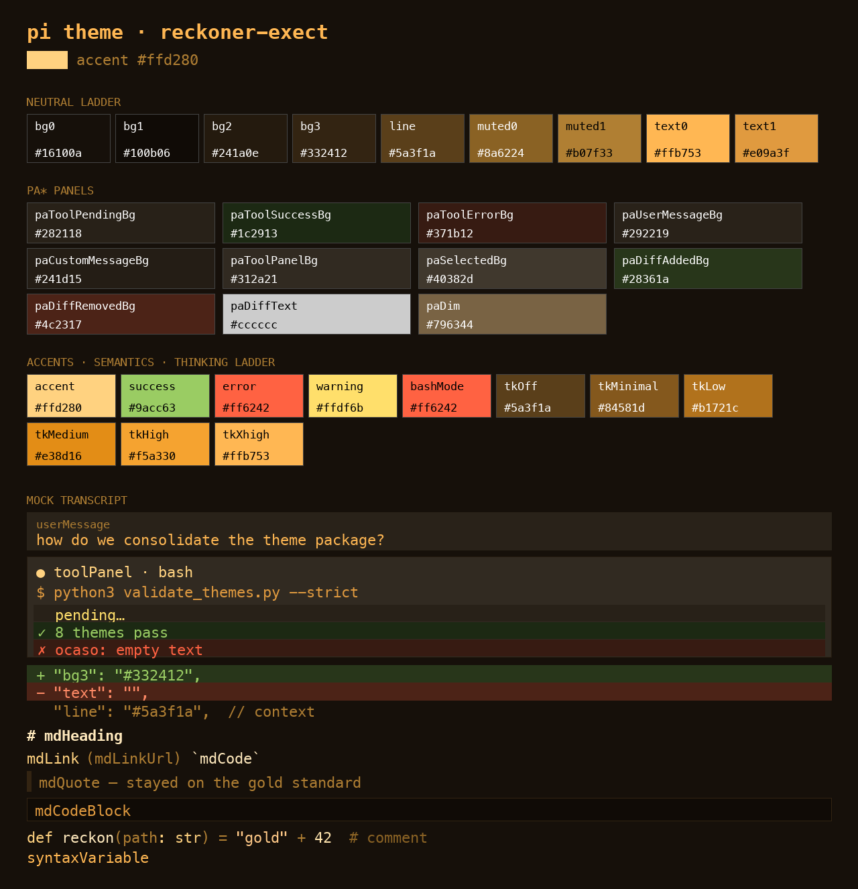
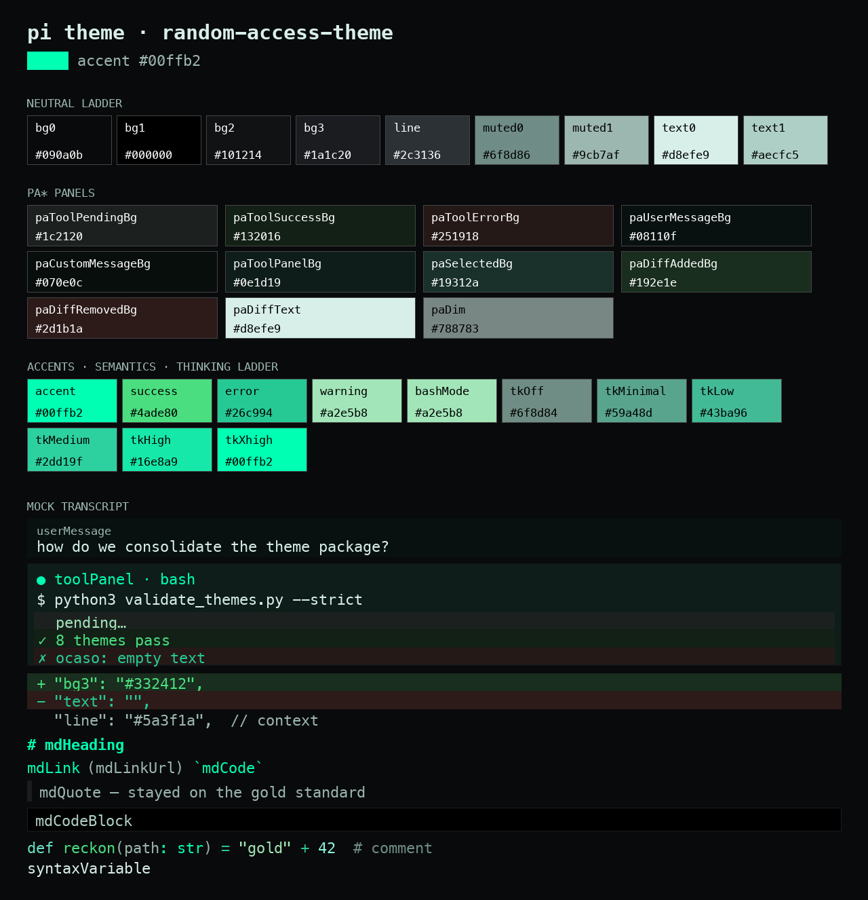
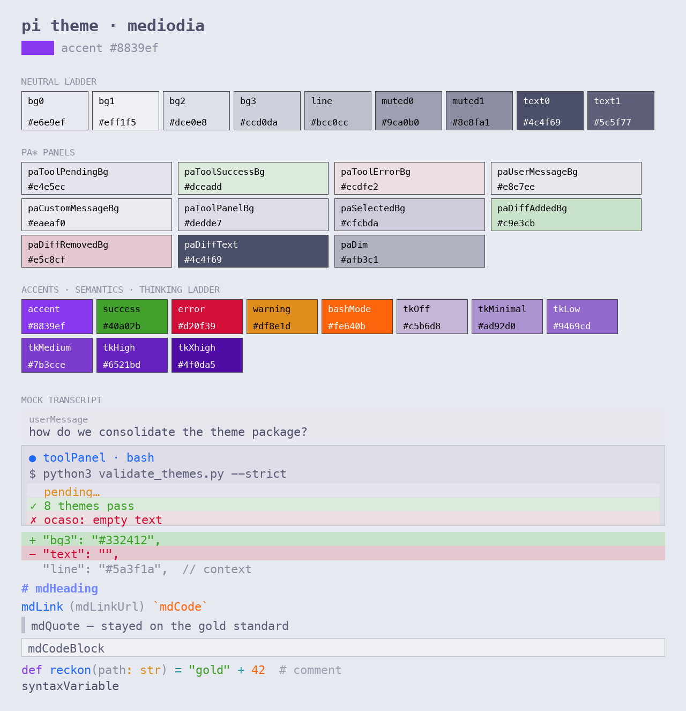
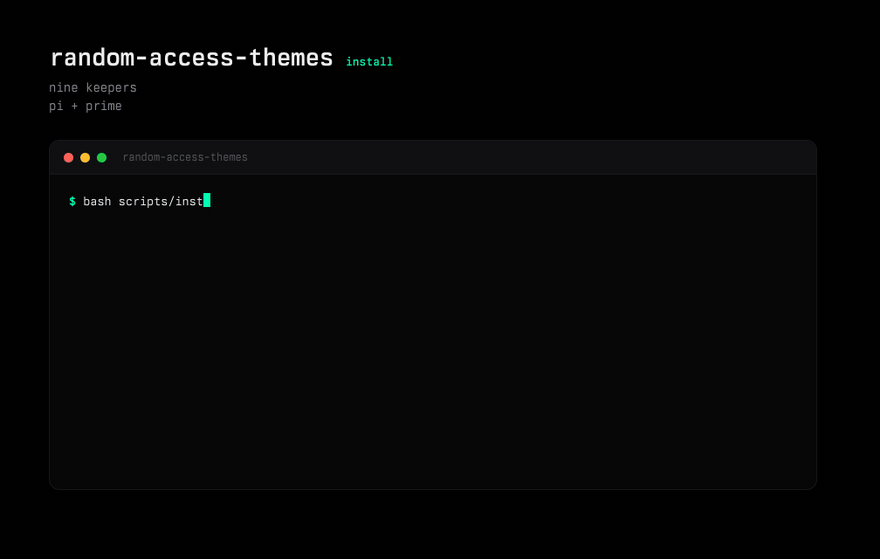

# Random Access Themes

[](https://github.com/sainzs/random-access-themes/actions/workflows/validate.yml)
[](LICENSE)
[](https://github.com/sainzs/random-access-themes/releases)

Nine keepers. One phosphor each. Hierarchy from brightness, never from a second hue.

<p align="center"></p>

**At a glance**
- **6 phosphor tubes** — amber, green, teal, blue, violet, orange
- **1 flagship** — electric mint on true OLED black
- **2 hours** — Rosé Pine dawn, Catppuccin noon (the only light theme)
- Ports: Ghostty, WezTerm, iTerm2, Alacritty, kitty, Windows Terminal, Pi, Prime
- Contract: `python3 themes/pi/validate_themes.py --strict`

---

## The nine

| Theme | Glow | Ground |
|---|---|---|
| `reckoner-exect` | amber 39° | `#16100a` — VT520 gold standard |
| `reckoner-factory` | orange 20° | `#000000` — safety orange on true black |
| `reckoner-scope` | green 138° | `#0a120c` — P1 phosphor, DEC VT640 |
| `random-access-theme` | mint 162° | `#000000` — flagship, Daft Punk |
| `reckoner-darkspace` | teal 174° | `#020b0c` — dark.spaceAMP wireframe |
| `reckoner-wopr` | blue 205° | `#0b1d3a` — the WOPR console |
| `reckoner-dusk` | violet 261° | `#1c1b29` — lavender twilight |
| `amanecer` | rose 2° | `#191724` — Rosé Pine, dawn |
| `mediodia` | paper 266° | `#e6e9ef` — Catppuccin Latte, noon |

<p align="center">
  
</p>
<p align="center">
  
</p>
<p align="center">
  
</p>

The other six cards live in [`assets/pi/`](assets/pi/). Seven hue-duplicates
(amnesiac, anochecer, atardecer, madrugada, ocaso, veridis, voyager) sit in
[`archive/themes/pi/`](archive/themes/pi/) — not gone, just off the picker.

---

## Install

<p align="center"></p>

### One line, no clone

```bash
curl -fsSL https://raw.githubusercontent.com/sainzs/random-access-themes/main/scripts/get.sh | bash -s -- pi
```

Targets: `alacritty` · `wezterm` · `ghostty` · `kitty` · `iterm2` · `windows-terminal` · `pi` · `all`.
The `pi` target installs the nine keepers. Pin a release with `RAT_REF=v0.1.2`.
Add `--dry-run` to preview.

### From a clone

```bash
bash scripts/install.sh --dry-run
bash scripts/install.sh --theme reckoner-exect
```

Links every keeper into `~/.pi/agent/themes/` (and `~/.prime/agent/themes/`
with the `prime` target), writes Ghostty from the generated export, backs up
what it replaces. Then `/reload` in the agent.

```bash
/theme reckoner-exect
```

pi resolves a theme by the `name` inside the JSON, not the filename, and falls
back to built-in `dark` **silently**. After install, the name in
`~/.pi/agent/settings.json` must appear in `ls ~/.pi/agent/themes/`.

### Terminals

| | exect | scope | wopr | darkspace | dusk | factory | random-access |
|---|:---:|:---:|:---:|:---:|:---:|:---:|:---:|
| Ghostty | [conf](themes/ghostty/reckoner-exect.conf) | [conf](themes/ghostty/reckoner-scope.conf) | [conf](themes/ghostty/reckoner-wopr.conf) | [conf](themes/ghostty/reckoner-darkspace.conf) | [conf](themes/ghostty/reckoner-dusk.conf) | [conf](themes/ghostty/reckoner-factory.conf) | [conf](themes/ghostty/random-access-theme.conf) |
| WezTerm | [toml](themes/wezterm/reckoner-exect.toml) | [toml](themes/wezterm/reckoner-scope.toml) | [toml](themes/wezterm/reckoner-wopr.toml) | [toml](themes/wezterm/reckoner-darkspace.toml) | [toml](themes/wezterm/reckoner-dusk.toml) | [toml](themes/wezterm/reckoner-factory.toml) | [toml](themes/wezterm/random-access-theme.toml) |
| iTerm2 | [itermcolors](themes/iterm2/reckoner-exect.itermcolors) | [itermcolors](themes/iterm2/reckoner-scope.itermcolors) | [itermcolors](themes/iterm2/reckoner-wopr.itermcolors) | [itermcolors](themes/iterm2/reckoner-darkspace.itermcolors) | [itermcolors](themes/iterm2/reckoner-dusk.itermcolors) | [itermcolors](themes/iterm2/reckoner-factory.itermcolors) | [itermcolors](themes/iterm2/random-access-theme.itermcolors) |
| Alacritty | [toml](themes/alacritty/reckoner-exect.toml) | [toml](themes/alacritty/reckoner-scope.toml) | [toml](themes/alacritty/reckoner-wopr.toml) | [toml](themes/alacritty/reckoner-darkspace.toml) | [toml](themes/alacritty/reckoner-dusk.toml) | [toml](themes/alacritty/reckoner-factory.toml) | [toml](themes/alacritty/random-access-theme.toml) |
| kitty | [conf](themes/kitty/reckoner-exect.conf) | [conf](themes/kitty/reckoner-scope.conf) | [conf](themes/kitty/reckoner-wopr.conf) | [conf](themes/kitty/reckoner-darkspace.conf) | [conf](themes/kitty/reckoner-dusk.conf) | [conf](themes/kitty/reckoner-factory.conf) | [conf](themes/kitty/random-access-theme.conf) |
| Windows Terminal | [json](themes/windows-terminal/reckoner-exect.json) | [json](themes/windows-terminal/reckoner-scope.json) | [json](themes/windows-terminal/reckoner-wopr.json) | [json](themes/windows-terminal/reckoner-darkspace.json) | [json](themes/windows-terminal/reckoner-dusk.json) | [json](themes/windows-terminal/reckoner-factory.json) | [json](themes/windows-terminal/random-access-theme.json) |

amanecer and mediodia are pi-only (upstream already ships the terminals).
Veridis, voyager and amnesiac still have terminal and editor ports; they are
no longer in the pi picker.

---

## Why it looks like this

A real CRT could not show many hues, so it built hierarchy out of luminance —
dim for what is resting, bright for what matters, a hot peak for what is
happening now. The six reckoners spend a single phosphor the same way. The
flagship compresses the same idea onto OLED black with a mint family and
**17.44:1** text contrast.

The thinking ramp is chroma, not lightness. Driven harder, a phosphor gets
more vivid, never more white. `make validate` enforces it across all nine.

Full philosophy: [docs/phosphor-themes.md](docs/phosphor-themes.md) ·
[docs/design.md](docs/design.md) · contract: [themes/pi/THEMES.md](themes/pi/THEMES.md).

---

## Development

Python 3.9+, `pyyaml`. Two pipelines, opposite directions: flavors generate
*from* `palette/*.yaml`; phosphors generate terminal exports *from*
`themes/pi/reckoner-*.json`. Never run one over the other's source.

| Command | What it does |
|---|---|
| `make generate` | Terminal themes from palette YAML |
| `make phosphor-exports` | Phosphor terminals from the pi JSON |
| `make validate` | Structure, freshness, ramps, no drift |
| `make contrast` | Full WCAG report |
| `make check` | generate + phosphor-exports + validate + contrast + tokens |

```bash
python3 themes/pi/validate_themes.py --strict
```

Map of what is source and what is derived: [docs/manifest.md](docs/manifest.md).

---

## Integrations

| Tool | File |
|---|---|
| tmux | [`integrations/tmux.conf`](integrations/tmux.conf) |
| fzf | [`integrations/fzf-export.sh`](integrations/fzf-export.sh) |
| bat | [`integrations/bat-config`](integrations/bat-config) |
| delta | [`integrations/gitconfig-delta`](integrations/gitconfig-delta) |
| Starship | [`integrations/starship.toml`](integrations/starship.toml) |
| eza | [`integrations/eza-export.sh`](integrations/eza-export.sh) |

Design tokens for web work live in [`tokens/`](tokens/). `make tokens` rebuilds them.

---

## License

[MIT](LICENSE) for everything original here.

amanecer is a Rosé Pine port (MIT). mediodia is Catppuccin Latte (MIT).
The archived day-cycle ports keep their upstream licences in [`NOTICE`](NOTICE).
