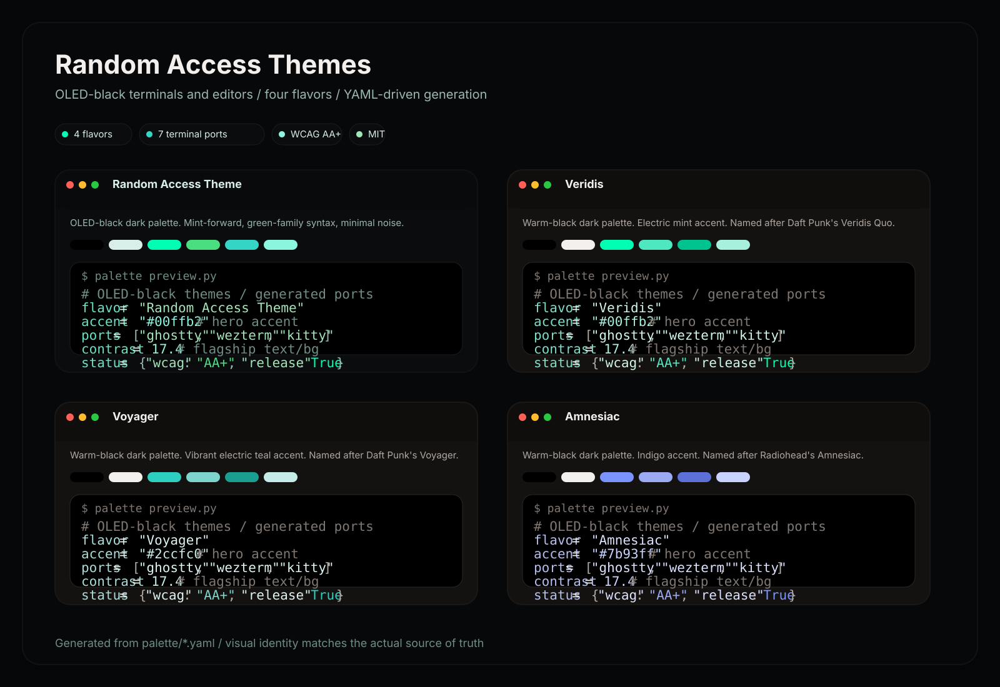
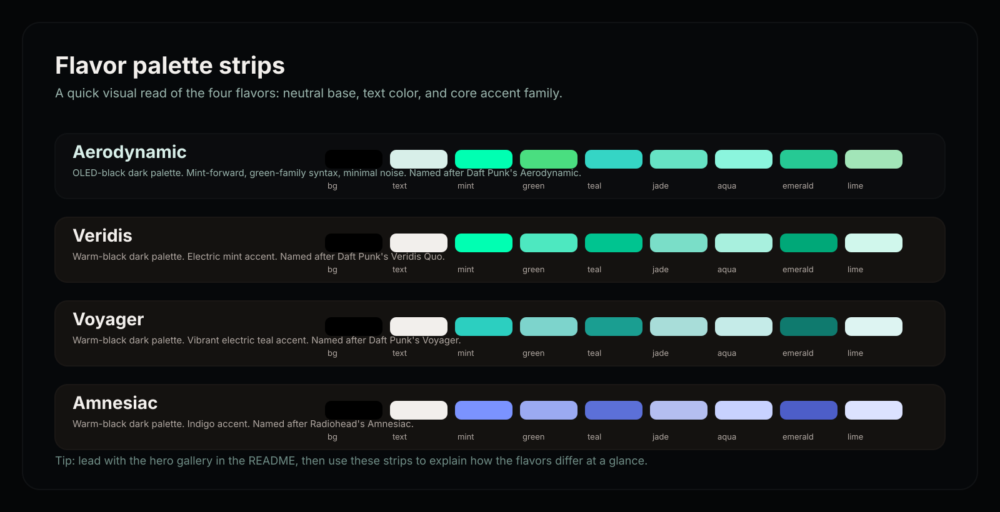

# Random Access Themes

[](https://github.com/sainzs/random-access-themes/actions/workflows/validate.yml)
[](LICENSE)
[](https://github.com/sainzs/random-access-themes/releases)

> Dark themes for terminals and editors — six phosphor tubes and four OLED-black flavors.



**At a glance**
- **6 phosphor themes** — one terminal tube each, hierarchy from brightness alone
- 4 OLED-black flavors: **Random Access**, **Veridis**, **Voyager**, **Amnesiac**
- 6–7 terminal ports each: Ghostty, WezTerm, iTerm2, Alacritty, kitty, Windows Terminal, Pi
- Editor ports today: VS Code, Sublime Text, Zed, Neovim (**Veridis**)
- Two pipelines, both validated: flavors generate from palette YAML, phosphors
  generate *from their pi theme* — see the [manifest](docs/manifest.md)
- Every thinking ramp is derived and enforced: escalation is chroma, not lightness



See the [demo preview](docs/demo.md) for the flagship terminal render and
rebuild commands.

---

## The phosphor family

Six themes, one terminal tube each. A real CRT could not show many hues, so it
built hierarchy out of luminance — dim for what is resting, bright for what
matters, a hot peak for what is happening now — and these spend a single phosphor
the same way. Love letters to specific hardware: a VT520 under amber, a VT640
radar scope, the WOPR's blue room.

They are the refined half of this repo and they set its standards. The
thinking-ramp rule every flavor now uses came from here, along with the validator
that enforces it, and nothing in the family blinks — which the Ghostty exports now
state outright rather than having the generator overrule.

Their pi themes are hand-authored and canonical: the terminal exports are derived
*from* that JSON rather than the other way round, because these arrived finished
and a pipeline built to spread a cool-spectrum palette across four flavors would
only have made them worse.

| Theme | Tube | Glow | Ports |
|---|---|---|---|
| `reckoner-exect` | EXECT-100 / DEC VT520 | amber phosphor | pi + 6 terminals |
| `reckoner-scope` | DEC VT640 | P1 green | pi + 6 terminals |
| `reckoner-wopr` | VT100 | navy + cyan | pi + 6 terminals |
| `reckoner-darkspace` | dark.spaceAMP | teal wireframe | pi + 6 terminals |
| `reckoner-dusk` | — | violet on blue-black | pi + 6 terminals |
| `reckoner-factory` | — | safety orange on true black | pi + 6 terminals |

<p align="center"></p>

Full descriptions, the brightness ladder, and the harness-footer vocabulary they
were tuned against: **[docs/phosphor-themes.md](docs/phosphor-themes.md)**.

They also brought the thinking-ramp rule the generator now uses — see below.

---

## Flavors

Four variants, one philosophy: dark surfaces, restrained UI chrome, and a cool-spectrum accent family.

| Flavor | Named after | Accent | Background | Description |
|--------|-------------|--------|------------|-------------|
| **Random Access** | Daft Punk — *Random Access Memories* | `#00ffb2` mint | `#000000` pure OLED black | Flagship. Mint-forward, green-family syntax, zero warm hues |
| **Veridis** | Daft Punk — *Veridis Quo* | `#00ffb2` mint | `#0f0e0d` warm black | Warm-dark base with crisp cream text and electric mint |
| **Voyager** | Daft Punk — *Voyager* | `#2ccfc0` teal | `#0f0e0d` warm black | Warm-dark base with a brighter teal-led accent family |
| **Amnesiac** | Radiohead — *Amnesiac* | `#7b93ff` indigo | `#0f0e0d` warm black | Warm-dark base with cool indigo contrast and sharper separation |

---

## Why it looks different

Most dark themes spread warm accents across the screen. Random Access Themes deliberately compress the visual range:
- **dark surfaces stay dark**
- **syntax lives in a tight accent family**
- **text stays high-contrast and calm**
- **WCAG contrast is treated as a hard requirement, not a nice-to-have**

The flagship Random Access palette reaches **17.44:1** text/background contrast and every foreground color clears **WCAG AA** against the base background.

See the full rationale in [docs/design.md](docs/design.md).

---

## Supported Ports

### Terminals — phosphor family

| Terminal | Amber EXECT | Green Scope | Cyan WOPR | Teal Darkspace | Violet Dusk | Orange Factory |
|----------|:---:|:---:|:---:|:---:|:---:|:---:|
| Ghostty | [conf](themes/ghostty/reckoner-exect.conf) | [conf](themes/ghostty/reckoner-scope.conf) | [conf](themes/ghostty/reckoner-wopr.conf) | [conf](themes/ghostty/reckoner-darkspace.conf) | [conf](themes/ghostty/reckoner-dusk.conf) | [conf](themes/ghostty/reckoner-factory.conf) |
| WezTerm | [toml](themes/wezterm/reckoner-exect.toml) | [toml](themes/wezterm/reckoner-scope.toml) | [toml](themes/wezterm/reckoner-wopr.toml) | [toml](themes/wezterm/reckoner-darkspace.toml) | [toml](themes/wezterm/reckoner-dusk.toml) | [toml](themes/wezterm/reckoner-factory.toml) |
| iTerm2 | [itermcolors](themes/iterm2/reckoner-exect.itermcolors) | [itermcolors](themes/iterm2/reckoner-scope.itermcolors) | [itermcolors](themes/iterm2/reckoner-wopr.itermcolors) | [itermcolors](themes/iterm2/reckoner-darkspace.itermcolors) | [itermcolors](themes/iterm2/reckoner-dusk.itermcolors) | [itermcolors](themes/iterm2/reckoner-factory.itermcolors) |
| Alacritty | [toml](themes/alacritty/reckoner-exect.toml) | [toml](themes/alacritty/reckoner-scope.toml) | [toml](themes/alacritty/reckoner-wopr.toml) | [toml](themes/alacritty/reckoner-darkspace.toml) | [toml](themes/alacritty/reckoner-dusk.toml) | [toml](themes/alacritty/reckoner-factory.toml) |
| kitty | [conf](themes/kitty/reckoner-exect.conf) | [conf](themes/kitty/reckoner-scope.conf) | [conf](themes/kitty/reckoner-wopr.conf) | [conf](themes/kitty/reckoner-darkspace.conf) | [conf](themes/kitty/reckoner-dusk.conf) | [conf](themes/kitty/reckoner-factory.conf) |
| Windows Terminal | [json](themes/windows-terminal/reckoner-exect.json) | [json](themes/windows-terminal/reckoner-scope.json) | [json](themes/windows-terminal/reckoner-wopr.json) | [json](themes/windows-terminal/reckoner-darkspace.json) | [json](themes/windows-terminal/reckoner-dusk.json) | [json](themes/windows-terminal/reckoner-factory.json) |
| Pi | [json](themes/pi/reckoner-exect.json) | [json](themes/pi/reckoner-scope.json) | [json](themes/pi/reckoner-wopr.json) | [json](themes/pi/reckoner-darkspace.json) | [json](themes/pi/reckoner-dusk.json) | [json](themes/pi/reckoner-factory.json) |

Pi is the source for these six; the terminal rows are derived from it.

### Terminals — flavors

| Terminal | Random Access | Veridis | Voyager | Amnesiac |
|----------|:---:|:---:|:---:|:---:|
| Ghostty | [conf](themes/ghostty/random-access-theme.conf) | [conf](themes/ghostty/veridis.conf) | [conf](themes/ghostty/voyager.conf) | [conf](themes/ghostty/amnesiac.conf) |
| WezTerm | [toml](themes/wezterm/random-access-theme.toml) | [toml](themes/wezterm/veridis.toml) | [toml](themes/wezterm/voyager.toml) | [toml](themes/wezterm/amnesiac.toml) |
| iTerm2 | [itermcolors](themes/iterm2/random-access-theme.itermcolors) | [itermcolors](themes/iterm2/veridis.itermcolors) | [itermcolors](themes/iterm2/voyager.itermcolors) | [itermcolors](themes/iterm2/amnesiac.itermcolors) |
| Alacritty | [toml](themes/alacritty/random-access-theme.toml) | [toml](themes/alacritty/veridis.toml) | [toml](themes/alacritty/voyager.toml) | [toml](themes/alacritty/amnesiac.toml) |
| kitty | [conf](themes/kitty/random-access-theme.conf) | [conf](themes/kitty/veridis.conf) | [conf](themes/kitty/voyager.conf) | [conf](themes/kitty/amnesiac.conf) |
| Windows Terminal | [json](themes/windows-terminal/random-access-theme.json) | [json](themes/windows-terminal/veridis.json) | [json](themes/windows-terminal/voyager.json) | [json](themes/windows-terminal/amnesiac.json) |
| Pi | [json](themes/pi/random-access-theme.json) | [json](themes/pi/veridis.json) | [json](themes/pi/voyager.json) | [json](themes/pi/amnesiac.json) |

### Editors

| Editor | Flavor |
|--------|--------|
| VS Code | [Veridis](themes/vscode/veridis-color-theme.json) |
| Sublime Text | [Veridis](themes/sublime/veridis.sublime-color-scheme) |
| Zed | [Veridis](themes/zed/veridis.json) |
| Neovim | [Veridis](themes/neovim/veridis.lua) |

---

## Install

### One-line install (no clone)

Fetch a generated theme straight to its standard location — no clone, no Python, no build step:

```bash
curl -fsSL https://raw.githubusercontent.com/sainzs/random-access-themes/main/scripts/get.sh | bash -s -- ghostty
```

Targets: `alacritty` · `wezterm` · `ghostty` · `kitty` · `iterm2` · `windows-terminal` · `pi` · `all`. Add `--dry-run` to preview, or pin a release with `RAT_REF=v0.1.2`. Existing files are backed up before they are overwritten. See [`scripts/get.sh`](scripts/get.sh).

### From a clone

### Ghostty

```bash
bash scripts/install.sh ghostty
```

Writes the full config to `~/.config/ghostty/config` and stubs the macOS Library config to prevent duplicate entries.

### WezTerm

```bash
cp themes/wezterm/random-access-theme.toml ~/.config/wezterm/colors/
```

Then in `wezterm.lua`:

```lua
config.color_scheme = "Random Access Theme"
```

### iTerm2

```bash
bash scripts/install.sh iterm2
```

Then: **Profiles > Colors > Color Presets > Import** and select the `.itermcolors` file.

### Alacritty

```toml
# In alacritty.toml
[import]
paths = ["/path/to/themes/alacritty/random-access-theme.toml"]
```

### kitty

```bash
echo "include /path/to/themes/kitty/random-access-theme.conf" >> ~/.config/kitty/kitty.conf
```

### Windows Terminal

Add the scheme from `themes/windows-terminal/random-access-theme.json` into the `"schemes"` array in your settings JSON.

### Pi

```bash
bash scripts/install.sh pi --theme reckoner-scope
```

Links all ten themes into `~/.pi/agent/themes/` and sets that one active. Then
`/reload`. By hand, if you prefer:

```bash
for t in themes/pi/*.json; do ln -sf "$PWD/$t" ~/.pi/agent/themes/; done
```

**Check that the theme actually took.** pi resolves a theme by the `name` field
inside the JSON, not by filename, and if the name in `settings.json` does not
resolve `initTheme` falls back to its built-in `dark` **silently** — no warning,
no log line, and a dark theme is plausible enough that you can look straight at
the fallback for weeks. A theme with a `/` in it, a package-qualified name, a
typo: all identical from the outside.

```bash
python3 -c "import json;print(json.load(open('$HOME/.pi/agent/settings.json'))['theme'])"
ls ~/.pi/agent/themes/ | sed 's/.json$//'
```

The first must appear in the second. `themes/pi/` holds ten: the four flavors and
the six phosphor tubes in [docs/phosphor-themes.md](docs/phosphor-themes.md).

---

## Integrations

Bonus configs for tools that inherit ANSI colors or benefit from explicit theming:

| Tool | File | What it does |
|------|------|-------------|
| tmux | [`integrations/tmux.conf`](integrations/tmux.conf) | Status bar and pane border colors |
| fzf | [`integrations/fzf-export.sh`](integrations/fzf-export.sh) | `FZF_DEFAULT_OPTS` color env vars |
| bat | [`integrations/bat-config`](integrations/bat-config) | Syntax highlighting theme |
| delta | [`integrations/gitconfig-delta`](integrations/gitconfig-delta) | Git diff colors |
| Starship | [`integrations/starship.toml`](integrations/starship.toml) | Prompt styling |
| eza | [`integrations/eza-export.sh`](integrations/eza-export.sh) | `EZA_COLORS` env vars |

---

## Palette

Flagship Random Access palette — all colors stay in a green-family range, including ANSI remaps.

| Role | Hex | Purpose |
|------|-----|---------|
| bg | `#000000` | Pure OLED black |
| text | `#d8efe9` | Primary text — green-tinted near-white |
| subtle | `#9cb7af` | Secondary text, labels |
| dimText | `#6f8d86` | Comments, disabled |
| mint | `#00ffb2` | Hero accent, cursor |
| green | `#4ade80` | Functions, success |
| teal | `#35d5c5` | Quotes, borders |
| jade | `#66e3c4` | Keywords |
| aqua | `#8bf5dd` | Numbers, highlights |
| emerald | `#26c994` | Errors (no warm red) |
| lime | `#a2e5b8` | Strings, warnings |

All foreground colors pass **WCAG AA** against `#000000`. Most reach **AAA**.

### Thinking levels

Pi shows how hard the model is being driven as one escalating colour, six levels
of it. **Escalation is chroma, not lightness.** Each ramp is derived in HSL from
the palette's quiet text up to its hero accent, holds the accent's hue for the
whole climb, and stops at the accent — never past it. A phosphor driven harder
gets more vivid, not more white.

It used to be six fixed palette slots — `subtle`, `emerald`, `teal`, `jade`,
`mint`, `aqua` — the same list for every flavor, which was not a ramp at all: it
fell at `minimal`, fell again at `high`, and finished on `aqua` at 75% lightness.
Amnesiac was worse, ending at 89% having crossed 208° of hue, so asking for more
reasoning turned the indicator pale and then a different colour entirely.

| flavor | off | xhigh | hue held |
|---|---|---|---|
| Random Access | `#6f8d84` | `#00ffb2` | 0° |
| Veridis | `#71817c` | `#00ffb2` | 1° |
| Voyager | `#718180` | `#2ccfc0` | 2° |
| Amnesiac | `#717481` | `#7a93ff` | 1° |

`make validate` enforces it across every theme in `themes/pi/`, flavors and
phosphors alike: no level above 74% lightness, none darker than the level below
it, and no more than 40° of hue across the ramp. The check came from the reckoner
project, where it was written after watching the top level go white on a screen
recording.

---

## Development

**Requirements:** Python 3.9+, `pyyaml`

```bash
pip install pyyaml
```

| Command | What it does |
|---------|-------------|
| `make generate` | Regenerate terminal themes from palette YAML |
| `make visuals` | Regenerate README SVG visuals from palette YAML |
| `make validate` | Structural + freshness + drift checks |
| `make contrast` | Full WCAG contrast report |
| `make check` | Generate + validate + contrast |
| `make phosphor-exports` | Derive phosphor terminal exports from `themes/pi/reckoner-*.json` |
| `make phosphor` | Regenerate the phosphor screenshots in `assets/phosphor/` |
| `make release` | Build release artifacts to `dist/` |

Installing to this machine is `scripts/install.sh`, which takes `--theme <name>`
(default `reckoner-scope`), links every pi theme, writes the Ghostty config from
`themes/ghostty/<theme>.conf`, and backs up anything it replaces:

```bash
bash scripts/install.sh --dry-run          # see it first
bash scripts/install.sh --theme reckoner-wopr
bash scripts/install.sh pi                 # one target only
```

Ghostty colours are read from the generated export rather than written into the
installer. They used to be a heredoc in that script — a second copy of the
flagship palette that no generator touched and no check compared, in the one file
whose job is to be the last word on what lands on a machine.

The source-of-truth map lives in [docs/manifest.md](docs/manifest.md), and the
public preview flow is documented in [docs/demo.md](docs/demo.md).

Each flavor has its own palette file in `palette/`. Edit the YAML, then regenerate the assets you changed.

README visuals in `assets/*.svg` are generated by [`scripts/render_repo_visuals.py`](scripts/render_repo_visuals.py).

---

## Design Tokens

The canonical palette is also exported as reusable design tokens for web and UI projects:

| Artifact | Path | Use case |
| --- | --- | --- |
| W3C-style tokens | `tokens/design-tokens.json` | All four flavors in one importable file |
| CSS variables | `tokens/random-access-theme.css` | Web projects using the flagship palette |
| Tailwind config | `tokens/tailwind.js` | Tailwind `extend colors` snippet |

Run `make tokens` to regenerate them after editing a palette.

## Portfolio

random-access-themes is the **design system** of the Random Access agent toolchain — four small packages that compose into one maintainer surface:

| Package | Layer | What it does |
| --- | --- | --- |
| [santiagosainz-skills](https://github.com/sainzs/santiagosainz-skills) | Workflow | Portable maintainer skills: review, planning, debug, verify, handoff |
| [reckoner](https://github.com/sainzs/reckoner) | Memory | Agent memory, auto-verification, and guardrails |
| [registro](https://github.com/sainzs/registro) | Reporting | Agent work report CLI and dashboard |
| **random-access-themes** | Design system | OLED-black themes and tokens shared across the toolchain |

## Contributing

See [CONTRIBUTING.md](CONTRIBUTING.md). The only files that should be edited manually are the palette YAML files in `palette/` plus repo docs / scripts. Theme files in `themes/` and README SVGs in `assets/` are generated.

## License

[MIT](LICENSE)
