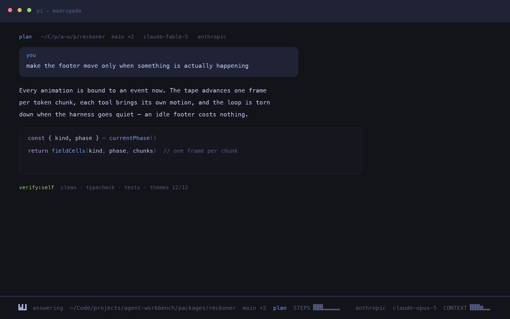
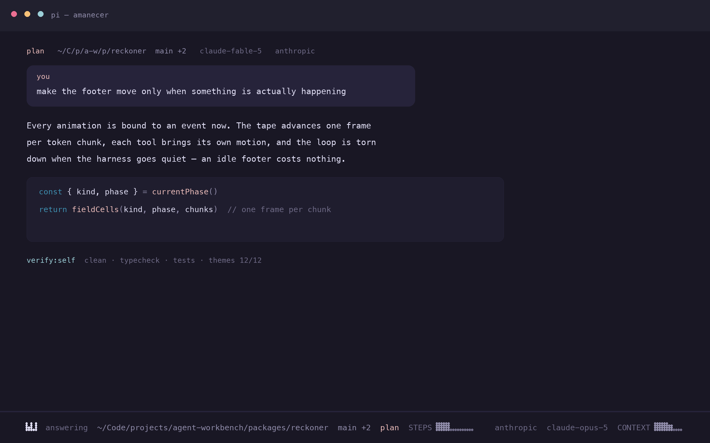
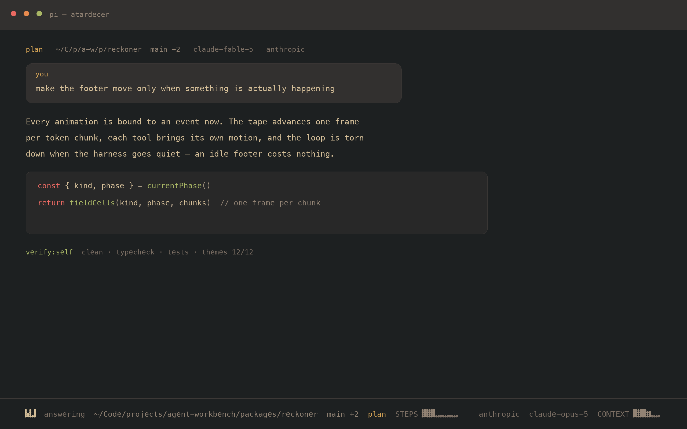
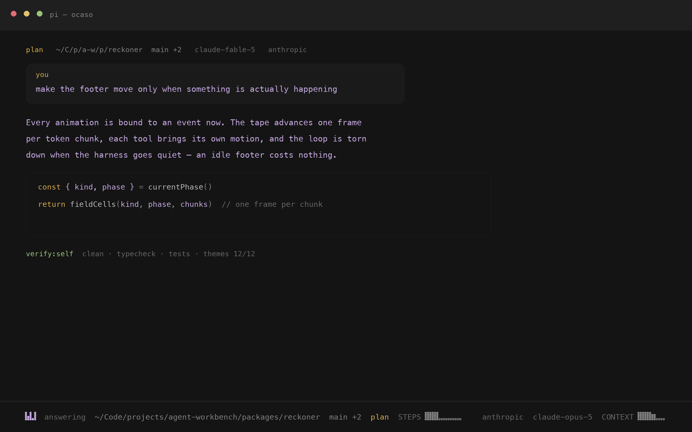
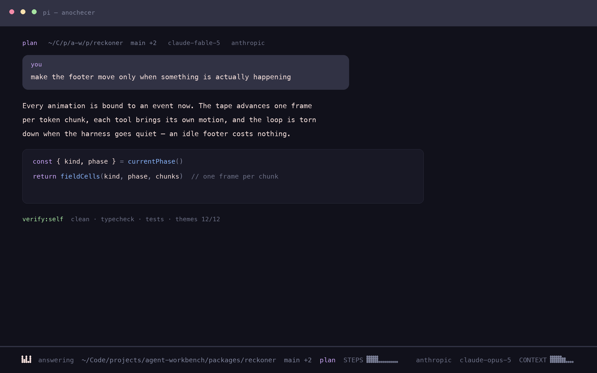

# The day cycle

Five pi themes named for the hours, darkest to brightest. Unlike the other two
families in this repo, four of these are **ports**: their colours belong to
upstream projects and are reproduced unchanged. Attribution and the statement of
changes Apache-2.0 requires are in [`NOTICE`](../NOTICE).

| Theme | Hour | Palette | Upstream | Licence |
|---|---|---|---|---|
| `madrugada` | before dawn | blue-violet night | [Tokyo Night](https://github.com/folke/tokyonight.nvim) | **Apache-2.0** |
| `amanecer` | dawn | rose and gold | [Rosé Pine](https://github.com/rose-pine/neovim) | MIT |
| `atardecer` | late afternoon | burnt ochre, olive | [Gruvbox Material](https://github.com/sainnhe/gruvbox-material) | MIT |
| `ocaso` | sundown | amber on ink | none identified | — |
| `anochecer` | nightfall | mauve | [Catppuccin](https://github.com/catppuccin/catppuccin) | MIT |

`mediodía` is missing on purpose. The cycle wants a light theme at its peak and
this repo has none; naming one after noon and shipping it dark would make the
name lie.

### madrugada

### amanecer

### atardecer

### ocaso

### anochecer

## Where they sit in the repo

They are **sources**, like the phosphor tubes and unlike the flavors: hand-held
JSON in `themes/pi/`, not generated from `palette/*.yaml`. Never run the palette
pipeline over them — it would overwrite the upstream colours that are the whole
point of a port.

They also have no exports. The phosphor family generates six terminal formats
from its pi themes; the day cycle does not, because the upstream projects already
publish their own terminal builds and a second-hand copy would drift from them.

## What was changed, and why

Only pi's six `thinking*` colours.

pi's thinking ramp says how hard the model is being driven, and none of these
upstream projects define one — it is a pi concept. The values that arrived with
the ports were assembled from whatever accents each palette happened to name, and
all five failed this repo's `validate_thinking_ramps` check on the day they were
tested:

| theme | what was wrong |
|---|---|
| `madrugada` | ramp did not climb; 75% and 79% lightness; wandered 91° of hue |
| `amanecer` | ramp did not climb; 78% and 83%; wandered 265° |
| `atardecer` | ramp did not climb; wandered 147° |
| `ocaso` | 77%; wandered 270° |
| `anochecer` | 76%, 81% and 86%; wandered 146° |

The limit is 40° of hue and 74% lightness. Every one of them also ended on its
palette's **error colour**, so asking for more reasoning looked like something
had broken — the exact defect the check was written to catch after watching a
recording of the footer.

Each ramp is now derived from its own palette's signature hue on the curve
`reckoner-scope` established: lightness 24.7 → 66.3%, saturation 27 → 67.4%, hue
held. The optional `thinkingMax` token was dropped, as no theme in this repo
carries it.

Syntax and interface colours are untouched and still match upstream exactly.
