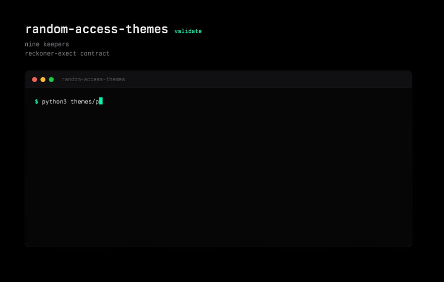
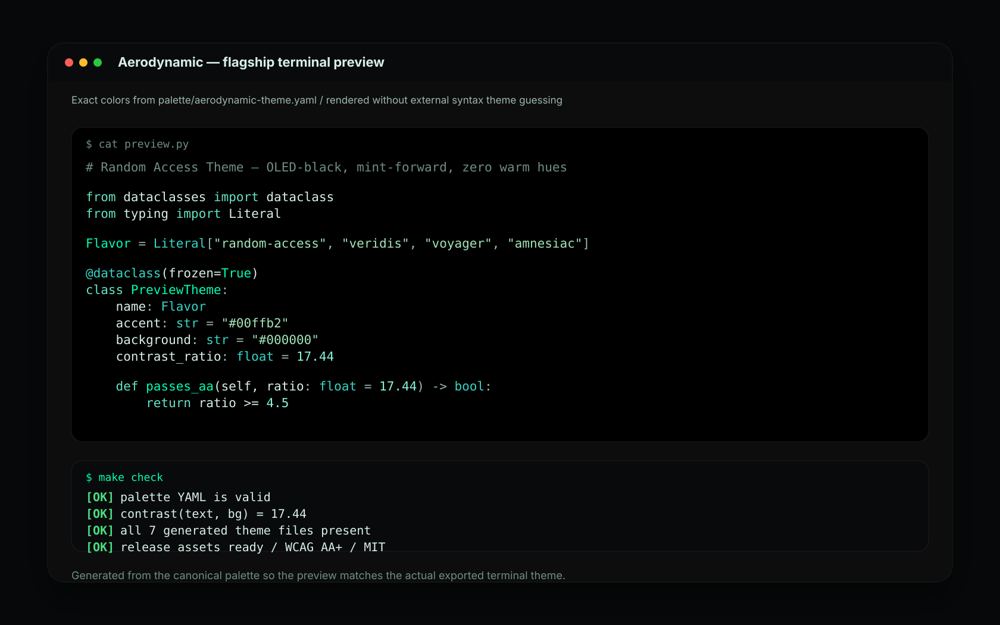

# Demo

Nine keepers. The public face is the contract cards in `assets/pi/` and the
cinta captures of `validate` and `install`. The flagship SVG below is still
rendered from the same YAML that generates the terminal exports.





## What This Proves

- The flagship Aerodynamic palette is rendered without external syntax-theme
  guessing.
- The preview uses the same canonical colors as
  `palette/aerodynamic-theme.yaml`.
- The release visuals are reproducible with the repo scripts.
- The PNG preview in `assets/preview.png` is a portable export of the generated
  SVG for social cards and package listings.

## Rebuild

```bash
make visuals
make check
```

`make visuals` refreshes `assets/flavors.svg`, `assets/palette-strips.svg`, and
`assets/preview.svg`. `make check` regenerates terminal themes, validates the
palette export set, and runs the WCAG contrast report.

## Hosting Notes

This page is intentionally plain Markdown so it works on GitHub today and can
later become the source for a small static docs site on Netlify, Vercel, or
GitHub Pages.
