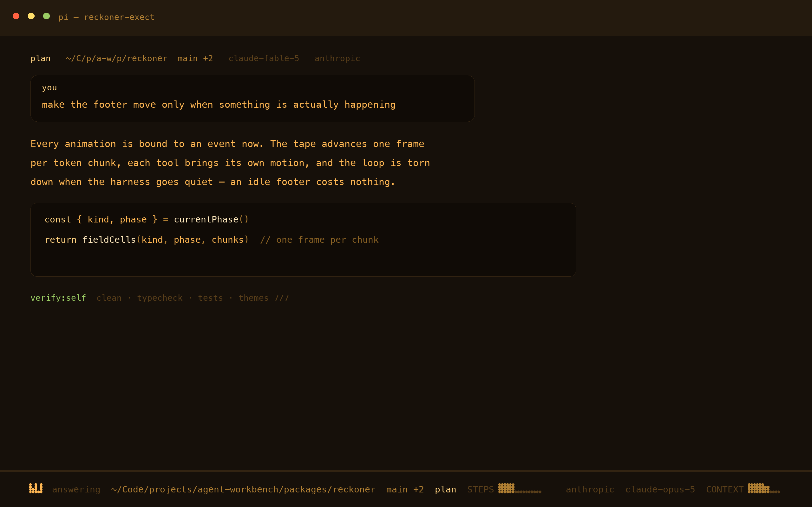
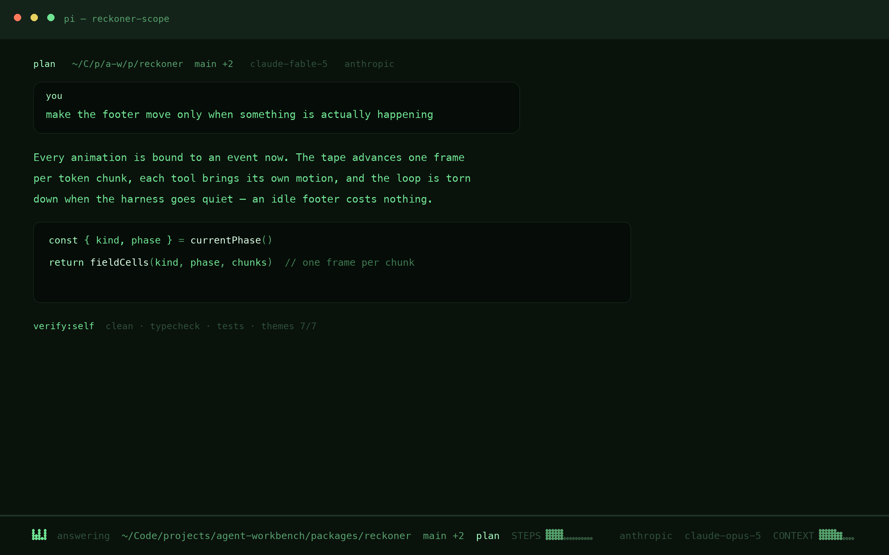
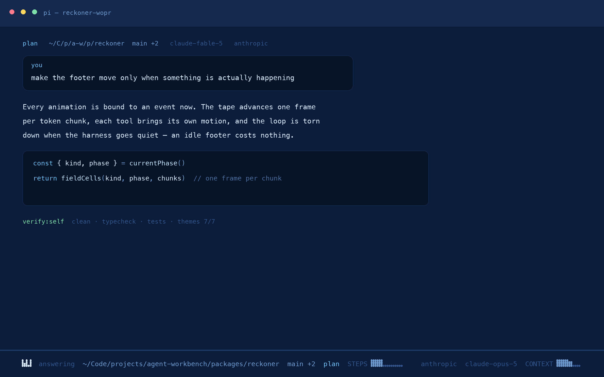
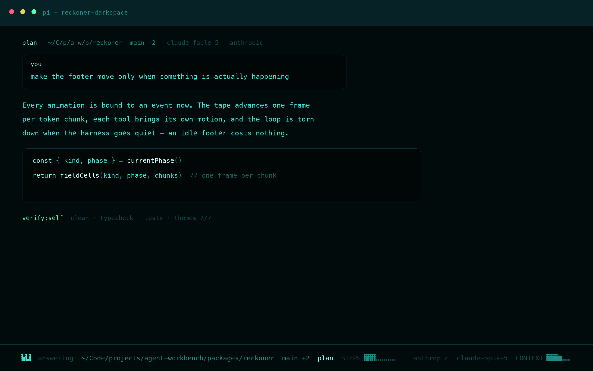
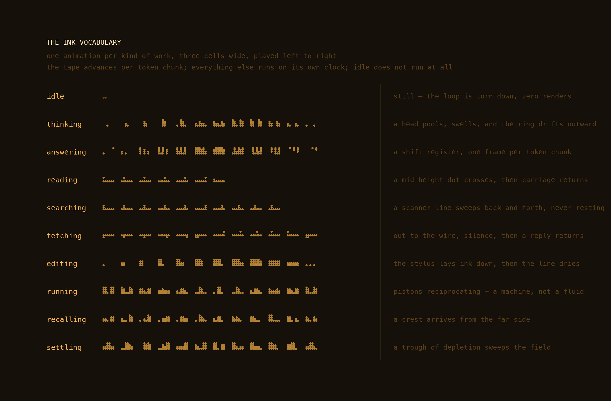
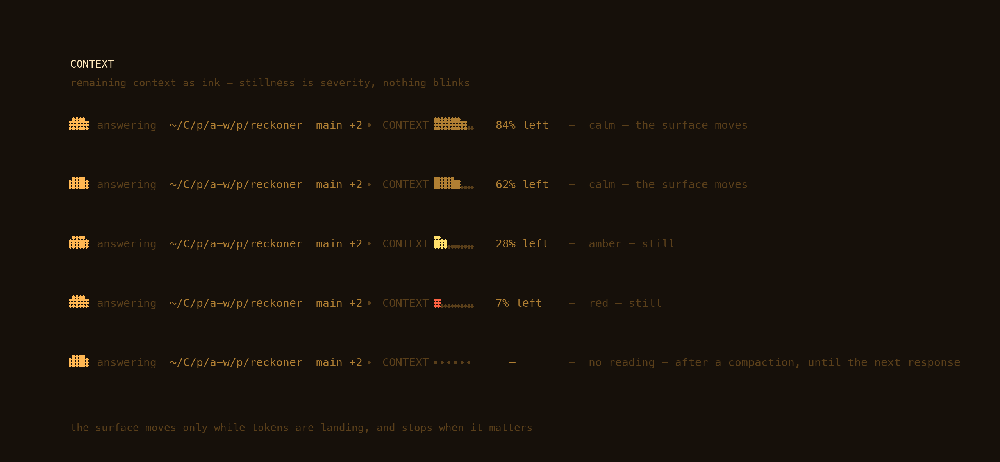

# The phosphor family

Six monochrome themes for [pi](https://github.com/mariozechner/pi-coding-agent),
each one a love letter to a real terminal tube, tuned to modern reading light.

> The case is printed, the values are the phosphor.

These set the standards in this repo. The thinking-ramp rule every flavor now
uses came from here, along with the validator that enforces it across all ten pi
themes, and the rule that nothing blinks — which the Ghostty exports now state
outright instead of having the generator overrule them.

The four flavors spread a cool-spectrum accent family across dark surfaces; these
spend a single phosphor and build hierarchy out of brightness alone, the way the
hardware had to. Their pi themes are hand-authored and canonical, with the six
terminal exports derived from that JSON — the opposite direction to the flavors,
for the reasons in [manifest.md](manifest.md).

## The philosophy

Every theme is **one phosphor, four brightnesses**. Real CRTs couldn't show many
hues, so they built hierarchy out of luminance: dim text for what's resting,
bright text for what matters, a hot peak for what's happening *now*.

| level | role |
|---|---|
| `dim` | chrome, separators, silkscreen labels, comments |
| `muted` | paths, branches, session names |
| `text` | the words you read |
| `accent` | keywords, links, the ink that is alive |
| `peak` | headings, the brightest point on the tube |

Syntax highlighting stays **inside the phosphor family** — a string is a brighter
ink, a comment is a dimmer ink, never a foreign hue. Code reads like it's on the
tube, not like a rainbow pasted over one.

## The four

Each screenshot is a real render of the theme's tokens — a mock pi session drawn
from the JSON itself, with the harness footer's braille ink as true dot matrices
on the character grid, and its frames read out of the footer's own source
(regenerated from the theme JSON, not drawn by hand).

| theme | tube | glow |
|---|---|---|
| `reckoner-exect` | EXECT-100 / DEC VT520 | amber phosphor |
| `reckoner-scope` | DEC VT640 | P1 green |
| `reckoner-wopr` | VT100 | navy + cyan |
| `reckoner-darkspace` | dark.spaceAMP | teal wireframe |

### exect

*EXECT-100 / DEC VT520 — amber phosphor.* Warm near-black under an amber tube. Hierarchy by brightness alone — the way real phosphor behaved.

<p align="center"></p>

### scope

*DEC VT640 radar — P1 green.* A radar scope drawn on green glass. The peak white-green is the bloom at the center of the trace.

<p align="center"></p>

### wopr

*VT100 blue screen — cyan + white-blue.* The WarGames war room. The one polychrome terminal in the family — green diffs, gold warnings.

<p align="center"></p>

### darkspace

*dark.spaceAMP (winamp) — teal wireframe.* A winamp skin on blackest glass — the EQ slider glow, tuned down to reading brightness.

<p align="center"></p>

## Install

```bash
mkdir -p ~/.pi/agent/themes
for t in themes/pi/reckoner-*.json; do
  ln -sf "$PWD/$t" ~/.pi/agent/themes/
done
```

Symlink, not copy. A copy is how a fork of this repo's own generated pi theme
came to sit in the reckoner package with six colours adrift and nobody the
wiser — which is why the thinking ramp is now derived rather than assigned.

## Switch

```text
/theme reckoner-exect       # in any pi session, after /reload
```

`/theme` lists everything installed. Reckoner's own `/tone` command uses the
package themes for its message styling.

## The harness footer

These themes were designed *with* the harness footer — the single-line braille
**ink system** (`extensions/harness-footer.ts`). The ink inherits the theme's
phosphor automatically; labels are silkscreen — uppercase and dim, like the
lettering on the chassis of the machines these themes came from.

The footer's leftmost field is three cells wide and never changes size. What
moves in those three cells says what the harness is doing, and each motion is
shaped like the work it stands for — a beam sweeps while it searches, a stylus
lays ink down while it edits, a dot goes out to the wire and waits for a reply.

<p align="center"></p>

Two rules hold the set together:

- **The tape is driven by the model, not by a clock.** `answering` advances one
  frame per token chunk, so its speed is the generation speed and a stall shows
  up as a freeze. Everything else runs on its own tempo — and each animation is
  played from its own first frame, so nothing is ever joined mid-cycle.
- **Idle is genuinely still.** Not a slow loop: the render loop is torn down
  when the harness goes quiet, so an idle footer costs nothing at all. Motion
  that never stops is motion that stops meaning anything.

The `CONTEXT ⣿⣿⣿⣷⣀⣀` well is remaining room as ink, and the one instrument on
the line reporting a quantity rather than a state. A shallow crest runs left to
right along the top of the filled region while the work is live — liquid in a
vessel just set down. It moves by taking dots away rather than adding them, so
it dies out on its own wherever the ink is already low: a cell with no top row
has nothing to lose, the wave reaches the shallows and stops, and no special
case says so. Below thirty percent the whole thing goes still — stillness is
severity, and nothing in the footer ever blinks.

Earlier it moved only at its meniscus and only while tokens were arriving, which
across a whole session came to three shapes: the gauge you consult to decide
whether to compact was, in practice, a still picture. Between a compaction and the
next response the harness genuinely does not know how full the context is; the
well shows a dead scale rather than leaving the panel, because a gauge that
comes and goes is worse than one admitting it has no reading:

<p align="center"></p>

The vocabulary lives in [`extensions/lib/footer-ink.ts`](../extensions/lib/footer-ink.ts);
the rejected designs and the bench that renders any of them live in
[`prototypes/`](../prototypes). Both images above are drawn from the real frame
tables, so a picture here can never show an animation the footer does not play.

## Tokens

| var | exect | scope | wopr | darkspace |
|---|---|---|---|---|
| bg | `#16100a` | `#0a120c` | `#0b1d3a` | `#020b0c` |
| dim | `#5a3f1a` | `#2e5038` | `#31548a` | `#0f4d53` |
| muted | `#b07f33` | `#55a06b` | `#6f9cd0` | `#1e8c85` |
| text | `#ffb753` | `#6fe392` | `#d9ecff` | `#3ce6da` |
| accent | `#ffd280` | `#a8ffc2` | `#6fc4ff` | `#7dfff2` |
| peak | `#ffe9bd` | `#dcffe7` | `#c4e6ff` | `#d2fffa` |
| success | `#9acc63` | `#6fe392` | `#7de0a8` | `#58ffb2` |
| warning | `#ffdf6b` | `#e8d25f` | `#ffd75f` | `#e8d25f` |
| error | `#ff6242` | `#ff7a5c` | `#ff7a8a` | `#ff5f7a` |

## Thinking levels

The six `thinking*` colours say how hard the model is being driven, and the
escalation is **chroma, not lightness**. Every ramp used to climb by getting
lighter, which meant the top of it left the theme behind: scope finished on
`#f0fff4`, wopr on `#eef8ff` — both white in everything but name, on themes whose
whole point is a single phosphor colour. Two themes were worse than washed out;
they changed hue entirely and landed on their own error colour, so asking for
more thinking looked like something had gone wrong.

Each ramp now runs from the theme's `dim` to its loudest ink that is still
unmistakably its hue — `accent`, or `text` where the accent has gone pale — and
stops there. `xhigh` **is** the theme's colour, at full strength; it never goes
past it. A phosphor driven harder gets more vivid, not more white.

| | off | minimal | low | medium | high | xhigh |
|---|---|---|---|---|---|---|
| exect | `#5a3f1a` | `#84581d` | `#b1721c` | `#e38d16` | `#f5a330` | `#ffb753` |
| scope | `#2e5038` | `#377248` | `#3c9757` | `#3ebf64` | `#54d37a` | `#6fe392` |
| wopr | `#31548a` | `#2f67b0` | `#2b7cd7` | `#3e95e8` | `#55adf6` | `#6fc4ff` |
| darkspace | `#0f4d53` | `#146f75` | `#189497` | `#1cbab8` | `#1fddd6` | `#3ce6da` |

`verify:themes` enforces it: no level may exceed 74% lightness, none may sit
more than 40° off the ramp's hue, and the ramp has to climb.

## Add your own

Copy any theme in `themes/pi/`, swap the `vars`, keep the ladder intact, and
`make validate` will tell you if you broke a key or a ramp. The thinking-level
check applies to every pi theme in the repo, generated or hand-authored.

---

[MIT License](../LICENSE) · [Contributing](../CONTRIBUTING.md) · [Code of Conduct](../CODE_OF_CONDUCT.md)
