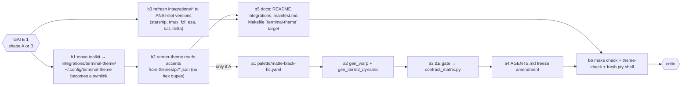

# Plan — bundle terminal-theme into the reckoner package (random-access-themes)

Package: `~/random-access-themes` (origin sainzs/random-access-themes, main @ cf75399).
Its AGENTS.md: **frozen** — "maintenance only, no new flavors, no new output targets";
`integrations/` and docs are curated exceptions. `docs/manifest.md` is the pipeline map.

## Explorer findings
- Pipeline: `palette/*.yaml` → `scripts/generate.py` → themes/{alacritty,ghostty,iterm2,kitty,
  pi,wezterm,windows-terminal}; phosphor tubes run backwards (`generate_phosphor.py`: pi JSON is
  the source). `make check` = generate + validate + contrast + tokens; `validate_theme.py` has a
  drift check ("installed Pi theme matches generated") and `themes/.checksum` freshness.
- `integrations/{starship.toml,tmux.conf,fzf-export.sh,eza-export.sh,bat-config,gitconfig-delta}`
  are hex-coded Random Access Green — superseded in the operator's dotfiles today by ANSI-slot
  versions that work for every flavor.
- Already landed in the package (cf75399): pi Surface rule, `derive_panels.py`, `make pi-panels`.
- No `profiles/` dir (README's "profiles/ghostty" is stale in the ~/Code checkout only).

## Two shapes

**B — freeze-respecting (recommended first)**: terminal-theme becomes a *satellite* under
`integrations/terminal-theme/`; accents are read from the pi theme JSONs so nothing is duplicated;
the six integration files are refreshed to the ANSI-slot versions. No new flavor, no new
generator target; `make terminal-theme` renders + gates. ~90 % of the value, zero architecture risk.

**A — lift the freeze**: B plus `palette/matte-black-hc.yaml` as a fifth flavor in the palette
schema, `gen_warp` + `gen_iterm2_dynamic_profile` targets in `generate.py`, per-terminal accent
overlays, ΔE gate folded into `contrast_matrix.py`, AGENTS.md freeze note amended. Medium-large;
touches the frozen core and every flavor's export set.

| id | goal | effort |
|----|------|--------|
| b1 | `git mv`-equivalent of theme.toml, bin/, README, shader stub, plans into `integrations/terminal-theme/`; `~/.config/terminal-theme` → symlink (same pattern as `~/.pi/agent/themes`) | cheap |
| b2 | `[terminals.X] accent_from = "reckoner-scope:text0"` etc.; renderer resolves via the pi JSON; check-contrast unchanged; theme-check PASS | medium |
| b3 | Replace the six hex-coded integration files with the ANSI-slot versions now live in the operator's dotfiles (headers: "works with every flavor: `blue` = accent") | cheap |
| b5 | README Integrations table + new row; `docs/manifest.md` curated list; Makefile `terminal-theme: render + check` | cheap |
| b6 | `make check`, `bin/theme-check`, fresh `script -q` zsh for the 4 TERM_PROGRAMs | cheap |
| a1–a4 | only under A | medium–expensive |

## Open decisions (Gate 1)
1. **A or B?** (B recommended; A can follow once Matte Black HC has lived a few weeks.)
2. Under B, keep `theme.toml` as TOML (renderer is TOML-native) — or port to the repo's YAML palette dialect for uniformity? (TOML recommended: it is an integration, not a palette.)
3. Push `~/random-access-themes` to origin after the lane? (Currently 1 commit ahead, cf75399.)

## Gate log
- Gate 1 (2026-09-03, operator): **B** approved. theme.toml stays TOML. No push.

## Execution (2026-09-03)
| node | status | evidence |
|---|---|---|
| b1 | done | toolkit at `integrations/terminal-theme/`; `~/.config/terminal-theme` → symlink; backups local (gitignored) |
| b2 | done | `accent_from` refs resolved by `bin/palette_lib.py` from `themes/pi/*.json`; brights derived by `hot()` (+8 % L, +35 % S) — a white blend greyed toward sage and failed ΔE; check-contrast PASS |
| b3 | done | six integrations on ANSI slots; starship print-config / zsh -n / tmux test server / git include all OK |
| b5 | done | README row + slot explanation, manifest.md, `make terminal-theme` |
| b6 | done | `make check` all passed; validate_themes --strict 9/9; theme-check PASS; pty shells ×4 |
| fix | done | surface rule scoped to the six tubes: random-access-theme (generated) + amanecer (port) exempt; amanecer restored; random-access regenerated |
Commits: `~/random-access-themes` 46152a4 (on top of cf75399; ahead of origin by 2, **not pushed**); `~/.pi` 2055fb3 (previews).
Gate 2: critic pending.

## Gate 2 (2026-09-03) — critic PARTIAL → fixed in dc3d332
12 findings: tracked arm64 binary (removed+ignored); theme-check hard-wired to one machine
(now skips absent tools, finds Python 3.11+, gates the repo's themes/pi); /opt/homebrew python in
Makefile/shebangs (PYTHON311 discovery, env shebangs, clear tomllib error); render-theme had no
backup/rollback despite README claim (now backups/<stamp>/ + rollback.sh, unchanged targets untouched);
manifest didn't say derive_panels owns pa*Bg (now does, plus consumer-not-member wording for
terminal-theme); themes/pi/backups/ unignored (ignored); fzf hex fallback → bg+:0; delta dark=true
kept; behaviour split out of colour files into shell-extras.sh; tmux no longer leans on slot 0;
$HOME instead of user paths; stale "amber" wording.
Critic's candid read on the freeze, recorded: letter holds (no palette flavor, no themes/ export);
spirit is thin — a satellite emitting five terminal formats under integrations/ is a loophole unless
the manifest names it a consumer-of, not member-of, the family. It now does; operator approved B.

## Concurrent peer lane — needs operator decision
A non-bus agent (opencode/herdr focus; `~/.config/opencode2/bin/theme-audit`) is editing theme.toml
and bin/render-theme in this dir: `[terminals.opencode]`, `[terminals.herdr]`, OpenCode theme JSON
emitted to `themes/opencode/matte-black-hc.json` **in the repo** (a new export in a frozen repo) and
to `~/.config/opencode{,2}/themes/`, a Herdr `[theme]` block spliced into `~/.config/herdr/config.toml`,
plus edits to `themes/opencode/{amnesiac,random-access-theme,veridis,voyager}.json`.
Left intact and UNSTAGED (recovered from stash after a pop mishap; verified: dry-run + theme-check PASS
with their code present). Not committed. Decide: (a) accept as the agent-surfaces extension and
amend the freeze note for `themes/opencode/`; (b) keep the user-dir outputs, drop the repo export;
(c) revert. Bus notice sent.
