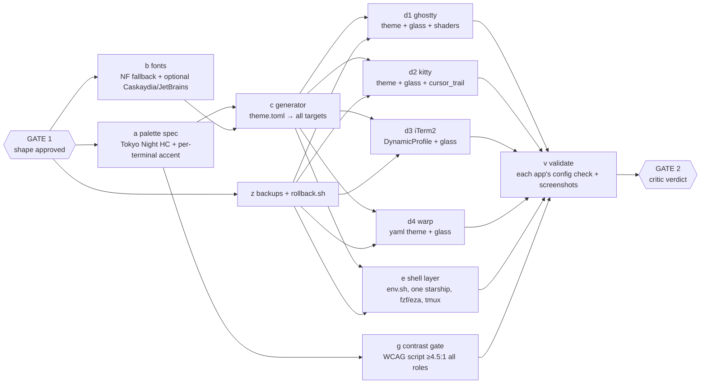

# Plan — modernize terminals (Omarchy-inspired, high contrast, glass, motion)

Work root: `~/.config/terminal-theme/` (new). Targets: Ghostty 1.3.1, kitty 0.47.2,
iTerm2 3.6.11, Warp 2026.08, plus the shell layer they share (starship 1.25, zsh
highlighting, fzf, eza, tmux 3.6b). macOS 26.6.

## Goal

One palette, one font stack, one glass recipe, one prompt — rendered to every
terminal from a single source of truth so they stop drifting (today iTerm/kitty,
Ghostty/Warp and the four `starship.*.toml` files disagree on hex values).
Look: Omarchy (Tokyo Night lineage, quiet chrome, generous padding, translucent
blurred surface) with contrast lifted to WCAG AA+ on every text role, subtle
motion (cursor trail / smear, bell, resize, quick-terminal), Berkeley Mono +
Nerd Font symbols.

## Explorer findings (what exists)

- Ghostty: `~/.config/ghostty/config` "Random Access Green", opacity 1 / blur 0,
  17 themes in `themes/`, empty `shaders/`, no custom-shader.
- kitty: `kitty.conf` same green palette hand-ported, opacity 1.0, no cursor_trail,
  `keybindings.conf` + Helix no_op block (keep intact).
- iTerm2: prefs in default plist, default profile GUID `8D8A0B25-…`, font
  BerkeleyMonoVariable-Regular 16 + BerkeleyMonoNerdFont 15, min contrast 0.05,
  `DynamicProfiles/` empty. Two `.itermcolors` in `~/.config/iterm2/`.
- Warp: `~/.warp/settings.toml` → theme "Glass Coder" yaml, opacity 100 / blur 0,
  font BerkeleyMono Nerd Font 16.
- Shell: `~/.config/shell/env.sh:143-187` switches `TERMINAL_*` colours +
  `STARSHIP_CONFIG` per `TERM_PROGRAM` (intent: "visually distinct, same base").
  `.zshrc` consumes those for zsh-syntax-highlighting, fzf, eza. tmux status has
  its own colours.
- Fonts installed: Berkeley Mono Variable, BerkeleyMono Nerd Font, Menlo. No
  CaskaydiaMono/JetBrains Mono NF.

## DAG

| id | goal | effort |
|----|------|--------|
| a  | `theme.toml`: Tokyo Night hues, bg darkened for glass, fg/comment/bright lifted; 4 accent hues (Ghostty blue, kitty purple, iTerm cyan, Warp green) | medium |
| b  | Verify Berkeley Mono + NF symbol fallback per app; `brew install --cask font-symbols-only-nerd-font`; optional Caskaydia/JetBrains NF as switchable alt | cheap |
| c  | `bin/render-theme` (python, stdlib): emits ghostty theme, kitty `theme.conf`, iTerm2 DynamicProfile JSON, Warp yaml, `shell/palette.sh`, starship colours, tmux colours | medium |
| d1 | Ghostty: theme, `background-opacity 0.86` + `background-blur 24`, `minimum-contrast 1.5`, `custom-shader` cursor trail (GLSL, `iCurrentCursor` uniforms), bell/resize motion; keep all keybinds | medium |
| d2 | kitty: theme, opacity/blur + `dynamic_background_opacity` with glass toggle key, `cursor_trail`, tab bar restyle; keep keybindings.conf + Helix block | medium |
| d3 | iTerm2: DynamicProfile "Tokyo Night HC" (transparency 0.14, blur radius 24, min contrast 0.3, fonts), set as default via `defaults write` (needs iTerm2 restart) | medium |
| d4 | Warp: `tokyo-night-hc.yaml` + settings.toml opacity 86 / blur 24 | cheap |
| e  | env.sh: replace hex block with `source palette.sh`; collapse 4 starship files → 1 (`❯`, dir, git, right duration); fzf/eza from palette; tmux status | medium |
| g  | `bin/check-contrast` — fails if any fg role vs bg (with glass composite) < 4.5:1; bright/fg < 7:1 | cheap |
| z  | snapshot every touched file to `backup-<date>/` + `rollback.sh` before any write | cheap |
| v  | `ghostty +validate-config`, `kitty --debug-config`, `plutil -lint`, yaml parse, `starship print-config`, tmux test server; `screencapture` each app for the critic | medium |

## Open decisions (answer at Gate 1)

1. **Palette**: Tokyo Night HC (canonical Omarchy default) — or Osaka Jade HC /
   Matte Black HC, which stay closer to today's black+green?
2. **Per-terminal accent tint** (keeps the existing "visually distinct" intent)
   — or one identical accent everywhere?
3. **Glass level**: opacity 0.86 / blur 24 (readable for long sessions) — or
   heavier (0.78 / 32)? A toggle key is included in kitty either way.
4. **Fonts**: keep Berkeley Mono as primary (recommended) with Nerd Font symbol
   fallback; install CaskaydiaMono NF as the Omarchy-faithful alternate?
5. **Light mode**: keep Ghostty/Warp auto light theme (needs a light HC palette
   too) — or dark-only?

## Gate log

- Gate 1 (2026-09-03, operator): **approved**. Palette = **Matte Black HC**
  (Omarchy `themes/matte-black/colors.toml`: bg #121212, fg #bebebe, amber
  accent #e68e0d — lifted to AA+). Operator: "look at Ghostty, we made cool
  changes" → current Ghostty config (Aug 24 typography/blending/titlebar/quick
  terminal/keybinds) is the reference base; port outward, don't regress it.
  Everything else delegated to the agent: per-terminal accent **yes**, glass
  0.88 + native `macos-glass-regular` (Ghostty 1.3 / macOS 26), Berkeley Mono
  primary + JetBrainsMono NF alt, **dark-only** (Matte Black has no light mode
  upstream).
- Design decision: per-terminal accent is carried in **ANSI slot 4/12** (blue)
  of each terminal's theme — Ghostty amber, kitty ember, iTerm2 steel, Warp
  gold. Shell layer (starship, zsh-highlight, fzf, eza, tmux) references
  `blue`/`colour4` only → one starship.toml, no `TERM_PROGRAM` case block.
  `TERMINAL_*` vars stay exported (single set) for anything still reading them.

## Execution status (2026-09-03)

| node | status | evidence |
|------|--------|----------|
| z | done | `backup-20260903-1723/` + `rollback.sh` (`backup-latest` symlink) |
| a | done | `theme.toml` |
| g | done | `bin/check-contrast` → PASS, 46 checks (solid + glass) |
| b | done | JetBrainsMono NF installed (brew); BerkeleyMono NF fallback explicit in Ghostty |
| c | done | `bin/render-theme` → 6 outputs |
| d1 | done | `ghostty +validate-config` VALID; `shaders/cursor-trail.glsl` compiles (glslang 16.5, Ghostty uniform stub); reload pending (Cmd+Shift+,) |
| d2 | done | kitty `load_config` 0 bad lines; live-reloaded in operator's running kitty (verified by screenshot: charcoal bg, ember cursor) |
| d3 | done | DynamicProfile JSON valid; `Default Bookmark Guid` → 7E1C0A1E-…; iTerm2 was not running |
| d4 | done | settings.toml parses; theme → matte-black-hc.yaml; opacity 88 / blur 24 |
| e | done | env.sh case block → `source palette.sh`; `.zshrc` hl/fzf/eza on ANSI slots; 4 starship files → 1 (`starship print-config` OK); fresh pty shells verified for all 4 TERM_PROGRAMs |
| v | partial | all deterministic gates PASS; only kitty screenshot obtained (Ghostty needs operator reload; off-screen demo windows capture blank) |
| Gate 2 | pending | critic (claude-opus-5, read-only) |

## Gate 2 (2026-09-03) — critic PARTIAL → fixed

Critic: claude-opus-5 `reviewer`, read-only. 13 findings, all addressed:
1. BLOCKER double config load via `~/Library/Application Support/com.mitchellh.ghostty/config` symlink → symlink moved into `backup-latest/` (rollback restores); `+show-config | grep -c custom-shader` = 1.
2. `unfocused-split-opacity` restored to 1 (operator's setting).
3. Warp `base00–0F` emitted by render-theme; Warp launched, theme verified by screenshot.
4. Accent/slot collisions → palette redesigned: green olive `#a4c883`, cyan `#7cc7bb`, magenta `#d795ab`; accents amber / steel `#86b3e0` / lilac `#b7a5e3` / orchid `#cd8fe0`. New **ΔE76 ≥ 25** perceptual gate (accent vs every semantic slot + white; cyan/white, red/magenta, green/yellow).
5. check-contrast composites over grey **and white** wallpaper; red/accents lifted to clear 4.5 on `#2e2e2e`.
6. `black` slot `#404040`, checked as a surface (≥1.3:1).
7. rollback.sh restores `keybindings.conf`, the symlink, and removes generated files.
8. kitty gate recorded properly: `kitty +runpy 'from kitty.config import load_config; b=[]; load_config("$HOME/.config/kitty/kitty.conf", accumulate_bad_lines=b)'` → `[]`.
9–10. dead `bold-is-bright` removed; `window-theme` back to `system`.
11. iTerm2 profile inherits cursor type/blink from "Default"; min contrast 0.15. Operator-visible bugs from first launch fixed: `Use Tab Color` off (was tinting the whole titlebar lilac), `Show Mark Indicators` off (blue gutter triangles).
12. iTerm2 + Warp launched and screenshotted (operator: "exquisite… right direction"). Ghostty screenshot still needs operator reload (Cmd+Shift+,).
13. Nerd Font fallback added to bold/italic/bold-italic families.

## Phase 2 (2026-09-03) — polish: accents, reckoner panels, motion

Operator: "keep polishing… use my reckoner theme green for the accents".
- Accents → reckoner greens (scope / random-access mint / darkspace teal / exect phosGreen);
  semantic green → sage `#93b58f`, cyan → sky `#82bfe0`. check-contrast PASS (WCAG ×3 + ΔE).
- k1 `~/.pi/agent/themes/derive_panels.py`: pa* of all 8 dark pi themes re-derived on `#121212`
  (backups in themes/backups/*.20260903-*). validate_themes --strict: 9/9 ok. Previews
  regenerated on the surface (`RECKONER_SURFACE`). THEMES.md: Surface rule.
- a1 Ghostty `shaders/focus-glow.glsl` chained after cursor-trail; both compile (glslang);
  `+show-config | grep -c custom-shader` = 2.
- a2 kitty `visual_bell_duration 0.08` (accent colour, no audio). load_config: 0 bad lines.
- r1 rendering: no change — operator's Berkeley Mono tuning kept; over-glass legibility is
  handled by `minimum-contrast 1.5` (Ghostty) / min contrast 0.15 (iTerm2) and the gate.
- Pending: Ghostty reload by operator (Cmd+Shift+,) for the first live look at shaders + glass;
  pi restart or `/theme` to pick up re-derived panels.

## Gate 3 (2026-09-03) — phase-2 critic PASS, 8 findings fixed
1. ΔE gate extended to accent_bright vs bright_* slots; scope greenHot → `#8dffb0` (ΔE 35.8 vs bright_green).
2–3. derive_panels recipe rebuilt (neutral tool panel, hued semantic panels) + adaptive separation
   pass; validate_themes.py now enforces pa* ΔE ≥ 6 from `#121212` and ≥ 5 pairwise. 9/9 ok.
4–5. Warp base16 ladder fixed (base02 divider, base03 muted text, base04 sky, base09 yellow).
6. rollback removes focus-glow.glsl. 7. bloom clamped (`min(…, 1.0)`, scaled by 1-col). 8. stale amber prose regenerated.
Also: kitty bell → accent_bright (softer flash); bat `--theme=ansi`; delta `syntax-theme ansi`, blue file header
(gitconfig + bat config backed up, rollback lines added); Ghostty `window-padding-color = background`
(operator: "border looks off" — `extend` paints padding opaque against glass; awaiting reload confirmation).

## Phase 3 (2026-09-03) — "keep polishing"
- `bin/theme-check`: single gate runner (13 checks) → PASS. Shader stub vendored at `ghostty-shader-stub.glsl`.
- Shell: fzf Ctrl-T (bat preview) / Alt-C (eza tree) / Ctrl-R (history + ctrl-y copy); MANPAGER via bat;
  eza `--group-directories-first`; zsh completion `menu select` + palette list-colors/descriptions.
  Fresh pty shell verified; `zsh -n` clean.
- Ghostty border fix confirmed by operator ("gorgeous") — `window-padding-color = background`.

## Commits (2026-09-03)
- `~/random-access-themes` **cf75399** — pi surface rule + derive_panels + validator gate + regenerated phosphor exports (ahead of origin by 1; not pushed).
- `~/.pi` **4240ee4**, **db2bfbd** — themes previews/tooling, then tooling symlinked from the package.
- `~/.config/terminal-theme` **836aa5c** — the toolkit (backups gitignored). Dotfiles themselves (ghostty/kitty/warp/zshrc/env.sh/starship/gitconfig/bat) are not under git; `backup-latest/rollback.sh` is their undo.
- Pre-existing, unrelated: `pi-verify --all` fails one skills-manifest count test (42 expected vs 29 on disk) — skills lane, not themes.

## Bundling into the reckoner package — recommendation
Yes. The package already runs the same pipeline (palette → generate.py → ghostty/kitty/iterm2/alacritty/wezterm/windows-terminal/pi; `generate_phosphor.py` derives terminal exports from the pi themes). What terminal-theme adds that the package lacks: Warp yaml, iTerm2 DynamicProfile JSON (vs .itermcolors), shell palette + starship-on-ANSI-slots, glass/motion config fragments, per-terminal accent-in-slot-4 profiles, and the ΔE76 separation gate (contrast_matrix.py has WCAG only). Proposed lane (own Gate 1): (1) add `matte-black-hc` as a palette flavor, (2) add `warp` + `iterm2-dynamic-profile` targets to generate.py, (3) fold check-contrast's ΔE gate into contrast_matrix.py, (4) express the four reckoner-green accents as `profiles/<terminal>/` overlays, (5) retire ~/.config/terminal-theme in favour of `make install`. Estimated medium; do it as a normal-subagent DAG with a critic.
